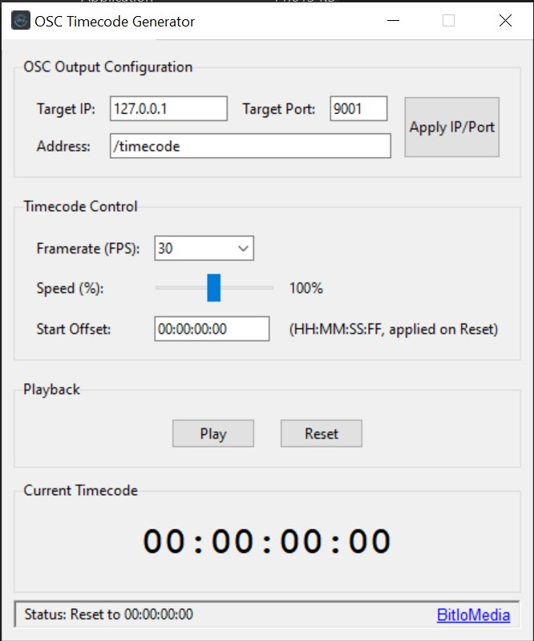

# OSC Timecode Generator

A simple desktop utility (Windows/macOS/Linux via source, Windows EXE available) to generate and send SMPTE timecode (HH:MM:SS:FF) over the network using OSC.

  

## Features

* Send timecode via OSC to configurable IP, Port, and Address.
* Selectable SMPTE framerates (30, 29.97, 25, 24, 23.976).
* Adjustable playback speed (0-200%).
* Set start timecode offset.
* Simple Play/Pause/Reset controls.

## Usage

**1. Windows Executable:**

* Download the `.exe` from the [Releases](https://github.com/BitloMedia/OscTimecodeGenerator/releases) page.
* Run the file (no installation needed). 

***Note:** Your browser or Windows SmartScreen/Antivirus might show a warning because the application is not code-signed. This is expected for small utility applications. You may need to choose "Keep" or "Run anyway".

**2. Run from Source (Python 3 needed):**

1.  Clone repo: `git clone https://github.com/BitloMedia/OscTimecodeGenerator.git`
3.  Install dependency: `pip install python-osc`
4.  Run: `python osc_timecode_generator.py`

## Credits

Created by [BitloMedia](https://github.com/BitloMedia) 
